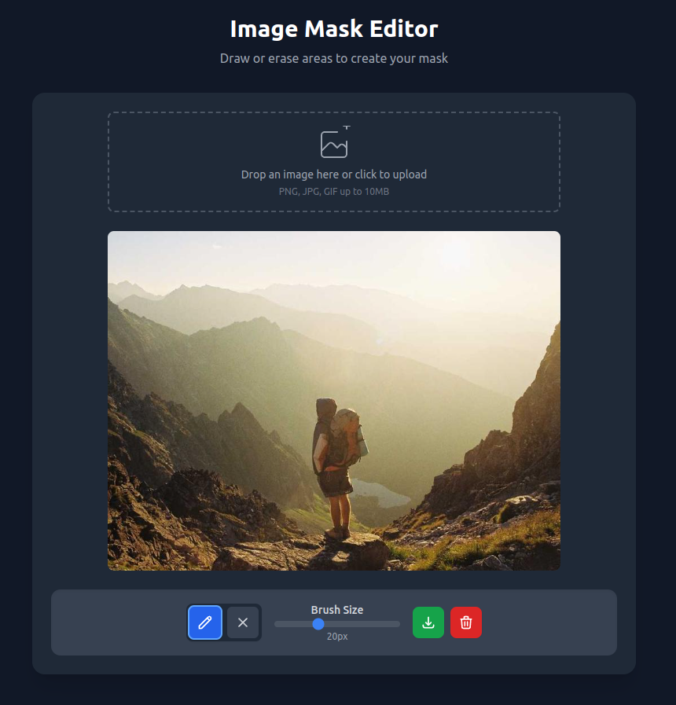

# 🎨 Next.js Image Mask Drawer

<p align='center'>
<a href="https://easymask.surge.sh" target="_blank"></a>
</p>


A modern, performant, and touch-friendly image mask drawing tool built with Next.js and TypeScript. Create masks and annotations on images without using Canvas!



## ✨ Key Features

- 🚀 **No Canvas API** - Uses pure DOM elements for better performance and easier manipulation
- 📱 **Touch Support** - Works seamlessly on mobile devices and tablets
- 🎯 **Precise Controls** - Adjustable brush size and eraser tool
- 💾 **Easy Export** - Export your masks as transparent PNG images
- 🔄 **Responsive Design** - Adapts perfectly to any screen size
- 🎮 **Intuitive UI** - Clean, minimal interface with icon-based controls

## 🛠️ Built With

- Next.js 14
- TypeScript
- Tailwind CSS
- React Hooks
- DOM Manipulation

## 🚀 Getting Started

1. Clone the repository:
```bash
git clone https://github.com/yourusername/mask-drawer.git
```

2. Install dependencies:
```bash
cd mask-drawer
npm install
```

3. Run the development server:
```bash
npm run dev
```

4. Open [http://localhost:3000](http://localhost:3000) in your browser

## 💡 Why This Project?

- **Performance First**: By avoiding Canvas, we achieve better performance with large images
- **Easy to Customize**: Simple DOM-based approach makes it easy to modify and extend
- **Mobile-First**: Built with touch devices in mind from the ground up
- **Modern Stack**: Uses the latest web technologies and best practices
- **TypeScript**: Full type safety and better developer experience
- **Zero Dependencies**: No external drawing libraries needed

## 🌟 Use Cases

- Image Annotation Tools
- Photo Editing Applications
- Educational Software
- Medical Image Analysis
- Design Prototyping
- Content Creation Tools

## 🤝 Contributing

Contributions are welcome! Feel free to:

- 🐛 Report bugs
- 💡 Suggest features
- 🔧 Submit pull requests

## 📝 License

MIT License - feel free to use this in your projects!

## 🙏 Support

If you find this project useful, please consider:
- ⭐ Starring the repository
- 🔀 Forking it
- 📢 Sharing it with others

## 🔮 Future Plans

- [ ] Multiple mask layers
- [ ] Undo/Redo functionality
- [ ] Custom brush shapes
- [ ] Mask opacity control
- [ ] Keyboard shortcuts
- [ ] Save/Load masks
- [ ] Color picker for masks

---

<!--
### 🌟 Star History

[](https://star-history.com/#yourusername/mask-drawer&Date)


Built with ❤️ by [Your Name]

-->